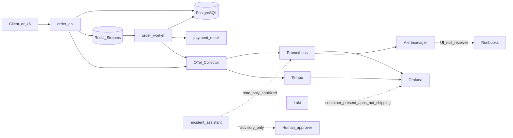

# OrderFlow Architecture

**Project:** 6425 Reliability Lab: OrderFlow  
**Status:** Local Compose lab runnable (`make up` / `make e2e`). Observability includes Prometheus scrapes, Alertmanager (UI/null receiver), Tempo with API→worker linked traces, Grafana RED+queue dashboard. Loki container is present but **apps do not ship logs to Loki yet**. kind/Argo demos are scripted; claim only after rehearsal. Azure remains plan-only (STOP-gated).  
**Audience:** Interviewers, reviewers, and future maintainers of this portfolio lab

## Purpose

OrderFlow is a **fictional restaurant ordering platform** built as a hands-on SRE / platform engineering portfolio. It demonstrates durable service design, async processing, observability, local Kubernetes reliability controls, GitOps, secure CI/CD, and optional Azure AKS — with explicit cost and safety gates.

It is **not** a production system for any real brand, venue, or employer.

## Honesty constraints

| Claim | Reality in this repo |
|---|---|
| “300 restaurants” | **Simulated** location IDs and load profiles only |
| “Lunch rush / stadium surge” | **Synthetic** traffic from k6 (or equivalent) scripts |
| “Payments” | `payment-mock` with controllable latency and failure — **no** real PSP |
| Cloud / AKS | Optional; **local-first** (Compose → kind). Paid Azure requires explicit approval |
| AI assistant | Advisory-only, fixture/eval-first; **no** autonomous mutate path |

No proprietary employer code, configs, transaction data, or internal documentation belongs in this repository.

## System overview

Three application services plus shared data and observability:

| Component | Role |
|---|---|
| `order-api` | FastAPI ingress: accept orders, persist, enqueue work, expose health/metrics |
| `order-worker` | Async consumer: kitchen-route simulation, retries/DLQ, duplicate-safe processing |
| `payment-mock` | Controllable payment dependency for fault drills |
| PostgreSQL | Source of truth for order state |
| Redis Streams | Work queue (backlog, consumer groups, idempotency demos) |
| OTel Collector | Telemetry pipeline to Prometheus, Loki, Tempo |
| Grafana (+ Alertmanager) | Dashboards, SLO burn visibility; Alertmanager UI for symptom alerts (null receiver — no paging) |
| `incident-assistant` | Phase 7: read-only advisory hypotheses from sanitized inputs |

### Local default path

1. **Docker Compose** — day-to-day development and E2E (`make up`).
2. **kind** — Kubernetes reliability controls (probes, PDB, HPA, rollout/rollback).
3. **Optional AKS** — Terraform modules exist for interview depth; apply is **STOP-gated**.

### Mermaid



## Request and processing flow (target design)

1. Client (or load script) submits an order to `order-api` with an **idempotency key**.
2. API validates, writes order state to Postgres, publishes a stream message to Redis Streams, returns accepted.
3. `order-worker` consumes via a consumer group, calls `payment-mock`, updates order state, emits metrics (including queue age).
4. Retries and a dead-letter path handle poison / transient failures without silent loss.
5. Telemetry flows through the OTel Collector; Grafana shows RED, queue depth/age, and SLO burn.
6. Alerts point to runbooks; the incident assistant (when enabled) proposes hypotheses only.

Exact schemas and API contracts are implemented under `apps/` and `packages/orderflow_common/`; this document locks **boundaries and responsibilities**.

## Repository layout (intended)

```text
orderflow/
  apps/
    order-api/
    order-worker/
    payment-mock/
    incident-assistant/     # Phase 7
  packages/orderflow_common/
  deploy/
    compose/                # local default
    kustomize/base|overlays/{local,staging,prod-like}
    argocd/
    argocd/
    chaos/                  # reserved; empty — drills live under scripts/drills/
  infra/terraform/          # plan-only until approved
  observability/
  tests/{unit,integration,load,eval}
  docs/
  scripts/{demo,drills,teardown}
```

## Deployment environments

| Environment | Runtime | Purpose | Cost posture |
|---|---|---|---|
| Local Compose | Docker | Default develop / E2E / OTel | Near $0 (electricity / host machine) |
| Local kind | Kubernetes on laptop/CI | Reliability controls, Argo CD, rollout demos | Near $0 |
| Azure `dev` / `prod-like` | AKS + supporting modules | Optional cloud proof | **Paid** — see STOP gates |

Manifests use **Kustomize** (base + overlays). Progressive delivery is a **documented canary simulation** plus Argo sync/rollback — not Flagger or a service mesh.

## Observability stack

- **Instrumentation:** OpenTelemetry traces + Prometheus metrics on API and worker; correlation IDs in structured logs.
- **Trace linking:** W3C `traceparent` carried on Redis Streams `QueueMessage` so Tempo shows one API→worker trace.
- **Collector:** `observability/otel-collector` (traces → Tempo; metrics also scraped directly by Prometheus).
- **Backends (local):** Prometheus, Grafana, Tempo, Alertmanager; Loki container present (**app log shipping deferred**).
- **Dashboards:** RED + queue + SLO burn — see `docs/screenshots/grafana-red-queue.png`.
- **Alerts:** `observability/alerts/rules.yml` → Prometheus → Alertmanager (`http://localhost:9093`).

## Reliability and SRE surfaces

Designed to be demonstrated, not merely asserted:

- Health / ready / startup probes; requests/limits; replicas; PDB; HPA; topology spread; graceful shutdown (kind overlays).
- Fault injection via `payment-mock` knobs, app-level failure modes, k6 profiles, and kubectl drills (see [ADR-004](adr/ADR-004-fault-injection.md)).
- SLOs and error-budget policy (draft: [slo-and-error-budget.md](slo-and-error-budget.md)).
- Runbooks and blameless postmortems under `docs/runbooks/` and `docs/incidents/`.

## Security and supply chain (target)

- No secrets in git; secret scanning in CI design.
- Image digests, SBOM, vuln scan, provenance/attestations (see [ADR-007](adr/ADR-007-image-provenance.md)).
- GitHub Actions: pinned actions, least privilege, environment protection for prod-like.
- OIDC → Azure documented; no long-lived cloud credentials as the happy path.
- AI path: sanitized inputs, advisory output only ([ADR-006](adr/ADR-006-ai-assistant-boundaries.md)).

## Explicit STOP gates (paid Azure and related)

Do **not** proceed without **explicit human approval** and a cost estimate in [cost-model.md](cost-model.md):

1. Creating any **paid Azure** resource.
2. Running `terraform apply` or `destroy` against a real cloud subscription.
3. Destructive cluster/data wipes beyond documented **local** teardown.
4. Accessing or storing real secrets or employer data.
5. Enabling a **paid** model API for the incident assistant (fixture/eval mode is the default).

Local Compose and kind work must remain the default demonstration path even after Azure modules exist.

## Deliberate non-goals

- Multi-cloud, Kafka, full service mesh, multi-region active-active.
- Chaos Mesh / Litmus unless a required drill cannot be shown otherwise.
- Real payment providers or production-scale claim language.
- Nesting this lab inside OpsForge Academy (unrelated Vite/React LMS).

## Related documents

- [Roadmap](roadmap.md) — phases 0–8 and definitions of done  
- [Cost model](cost-model.md)  
- [ADRs](adr/) — locked decisions  
- [Threat model](threat-model.md) — initial draft  
- [SLO and error budget](slo-and-error-budget.md) — initial draft  
